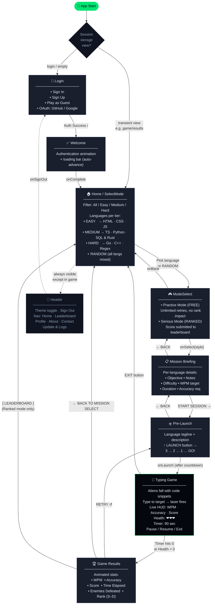

# TYPEC — Typing Practice App

A space-themed typing practice game built with React and Vite. Players sharpen their coding skills by typing real code snippets across multiple languages and difficulty modes.

---

## Features

- **Multiple language modes** — Practice HTML, CSS, and JavaScript snippets
- **Game flow** — Mode select → Mission briefing → Pre-launch countdown → Live typing game → Results
- **Light / Dark theme** — Toggle between themes, persisted across the session
- **Leaderboard** — Track and compare scores
- **Auth flow** — Login page with a welcome screen on first entry
- **Responsive layout** — Header and footer adapt to the current view (hidden during active gameplay)

---

## Tech Stack

| Layer | Technology |
|-------|-----------|
| Framework | React 19 |
| Build tool | Vite 8 |
| Styling | Tailwind CSS 4 |
| Icons | Font Awesome (React) |
| Linting | ESLint 10 |

---

## Project Structure

```
client/
├── public/
├── src/
│   ├── assets/
│   │   ├── component/
│   │   │   ├── header.jsx        # Top nav bar with theme toggle & sign out
│   │   │   ├── footer.jsx        # Site footer
│   │   │   └── HeroSection.jsx   # Landing hero block
│   │   ├── js/
│   │   │   └── index.js          # Shared JS utilities
│   │   ├── logo/
│   │   │   └── logo.png
│   │   ├── login.jsx             # Login / auth screen
│   │   ├── Welcome.jsx           # Post-login welcome animation
│   │   ├── home.jsx              # Home screen (wraps SelectMode)
│   │   ├── SelectMode.jsx        # Mode selection cards
│   │   ├── ModeSelect.jsx        # Play-style picker (after mode is chosen)
│   │   ├── MissionBriefing.jsx   # Mission details before launch
│   │   ├── PreLaunch.jsx         # Countdown screen
│   │   ├── TypingGame.jsx        # Core typing game engine
│   │   ├── GameResults.jsx       # End-of-game stats & actions
│   │   ├── leaderboard.jsx       # Leaderboard view
│   │   ├── profile.jsx           # User profile
│   │   ├── about.jsx             # About page
│   │   ├── contact.jsx           # Contact page
│   │   └── update&logs.jsx       # Changelog / update logs
│   ├── App.jsx                   # Root component & view router
│   ├── index.css                 # Global styles
│   └── main.jsx                  # React entry point
├── index.html
├── package.json
└── vite.config.js
```

---

## Getting Started

### Prerequisites

- Node.js 18+
- npm 9+

### Install dependencies

```bash
npm install
```

### Start the dev server

```bash
npm run dev
```

The app runs at `http://localhost:5173` by default.

### Build for production

```bash
npm run build
```

### Preview the production build

```bash
npm run preview
```

### Lint

```bash
npm run lint
```

---

## Game Flow



---

## Roadmap

### v1.0 — Core Game ✅ Done
The full single-player game loop is implemented and working.

| Feature | Status |
|---------|--------|
| Login / Sign Up / Guest / OAuth UI | ✅ |
| Welcome animation screen | ✅ |
| Mode select (9 languages + Random, 3 tiers) | ✅ |
| Play style picker (Practice / Ranked) | ✅ |
| Mission briefing per language | ✅ |
| Pre-launch countdown | ✅ |
| Typing game engine (aliens, laser, HUD) | ✅ |
| Game results with animated stats + rank | ✅ |
| Dark / Light theme toggle | ✅ |
| Header navigation (auth / unauth) | ✅ |

---

### v1.1 — Content Pages 🚧 In Progress
These views are linked from the header but are currently empty files.

| Feature | Status |
|---------|--------|
| Profile page — player stats, match history, badges (`profile.jsx`) | 🚧 Empty |
| Leaderboard page (`leaderboard.jsx`) | 🚧 Empty |
| About page (`about.jsx`) | 🚧 Empty |
| Contact page (`contact.jsx`) | 🚧 Empty |
| Updates & Logs page (`update&logs.jsx`) | 🚧 Empty |

---

### v1.2 — Backend & Auth 🔲 Planned
The server folder exists but is empty. All auth and data is currently frontend-only.

| Feature | Status |
|---------|--------|
| Express / Fastify server setup | 🔲 |
| Real user authentication (JWT / sessions) | 🔲 |
| User registration & login API | 🔲 |
| Persist game stats to database | 🔲 |
| Leaderboard API (global rankings) | 🔲 |
| User profile API (stats history) | 🔲 |
| OAuth integration (GitHub / Google) | 🔲 |

---

### v1.3 — Multiplayer 🔲 Planned
The header already links to a `multiplayer` route — the feature is planned but not started.

| Feature | Status |
|---------|--------|
| Competitive 1v1 matchmaking | 🔲 |
| Real-time race (WebSockets) | 🔲 |
| Ranked match scoring system | 🔲 |
| Match history & replays | 🔲 |

---

### v1.4 — Advanced Stats & UX 🔲 Planned

| Feature | Status |
|---------|--------|
| Per-finger latency metrics | 🔲 |
| Mistake heatmap (keyboard layout) | 🔲 |
| WPM progress graph over time | 🔲 |
| Custom keybindings | 🔲 |
| Mechanical switch audio themes | 🔲 |
| Mobile / touch support | 🔲 |
| Docs page | 🔲 |

---

## Backend (Server)

The server lives in the `server/` directory at the repo root (sibling to `client/`).

> Server is currently under development. This section will be updated as the backend is built out.

Planned responsibilities:

- User authentication (login / register)
- Persisting game stats and scores
- Leaderboard data API
- User profile management

### Running the server

```bash
# from the repo root
cd server
npm install
npm run dev
```

> Update this section with the actual stack (Express, Fastify, etc.), port, and environment variables once the server is set up.

---

## Session Behavior

View state is stored in `sessionStorage` under the key `typec_view`. Transient views (`welcome`, `modeselect`, `briefing`, `prelaunch`, `game`, `results`) are never restored on page refresh — the user is redirected to `home` instead.
